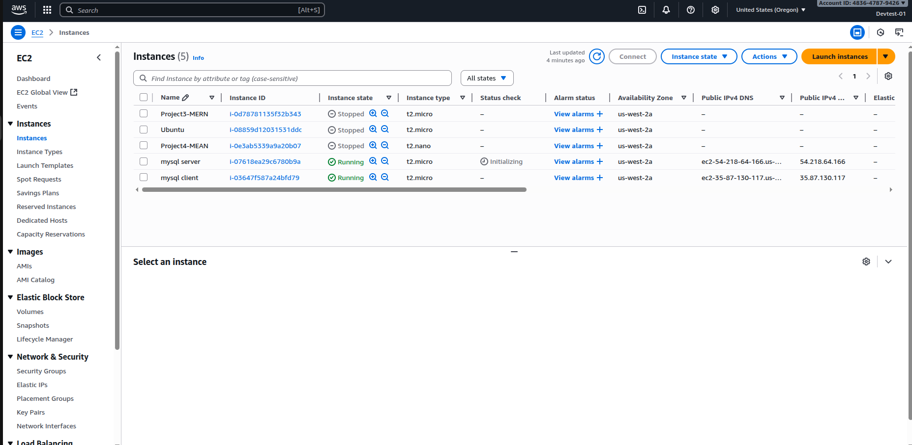

## Client-Server Architecture
Most sofware interact with database for storage of information and client are installed on end user.In order to access the database they have to connect to the database server.In this model we have covered client-server architecture by deploying an ec2 instance on amazon aws.

## prerequisite
- AWS account
- SQL commands
- mysql database

### Step 1. Launch EC2 instance on aws Dashboard
Navigate to aws dashboard after signing-in and create two ec2 instance
-mysql-server
-mysql-client


### Step 2. Installing Mysql-server
on the first ec2 instance ssh into the server, update and install mysql-server
```sh
   ssh -i mysql-server.pem ubuntu@public-ip
```
Then update the server
```sh
   sudo  apt update -y && sudo apt ugrade -y
```
Installing mysql server
```sh
   sudo apt install mysql-server -y
```
Install mysql-secure installation
```sh
   sudo mysql_secure_installation
``` 
Creating user and granting privileges


### Step 3. Updating Configs
Navigating to mysql config file to update the bind- address
```sh
  sudo nano /etc/mysql/mysql.config/mysqld.cnf
```


### Step 4. Updating Security Groups
Navigate to Security Groups in the mysql server and allow port 3306 to be accessible remotely by client server.


### Step 5. Installing client
Navigate to the second ec2 instance ssh into it and update the server before installing mysql-client

```sh
   sudo apt update -y && sudo apt ugrade -y
   sudo apt install mysql-client -y
```


### Step 6. Connecting to Server Remotely
On the client server,the database server can be accessed without using ssh


The client-server architecture has been demonstrated.
