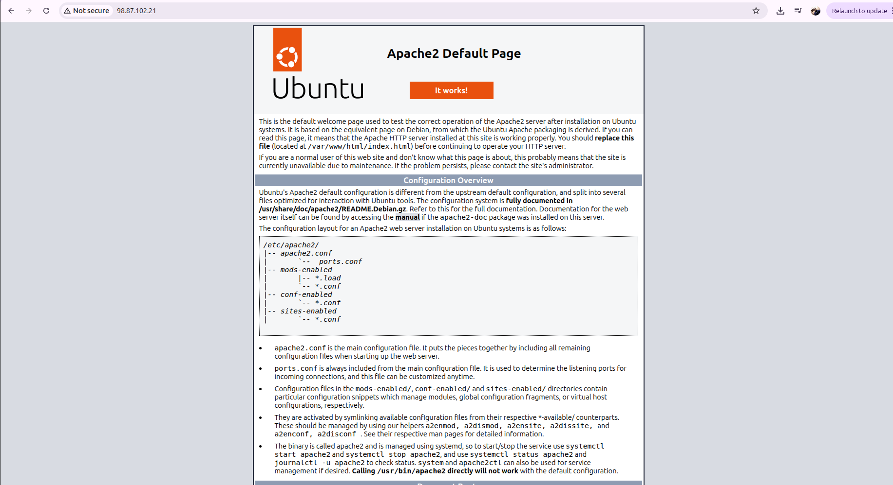

# Steps to Get Started in LAMP Stack
LAMP Stack consist of the following:Will be exploring how they work together to deploy a website
L-Linux Operating system that is used in many application
A-Apache
M-Mysql
P-Php

# Step 1. Launching an EC2 instance on AWS Account
Go to account console and search for EC2 then Launch an EC2 instance by giving a name and setting t2.micro,choosing ubuntu image and setting security groups to enable access via Public IP.
 

 faced a challenge accessing the server but managed to figure out it was because of the permission file.

# Step 2. Giving Permission to Pem file
```sh
    sudo chmod 400 LAMP.pem
```
# Step 2. SSH Into EC2 Instance using Public IP
By default the username will be ubuntu that will be used to access the EC2 Instance
```sh
     ssh -i LAMP.pem ubuntu@public_Ip 
```


# Step 3. Configuring Apache Web Server
After Connecting to the EC2 instance apache server is installed
```sh
   sudo apt update
   sudo apt install apache2
``` 
Veryfying that apache server is running
```sh
   sudo systemctl status apache2
```


# Step 4. Accessing Apache Server Using Public IP
Using Chrome browser apacher server can be accesssed using the following url

```sh
   http://98.87.102.21:80
```
 

 # Step 5. Installing Mysql Database
 Inside the EC2 Instance 
 ```sh 
    sudo apt install mysql-server
 ```
 
 After Successful installation of mysql access it through the EC2 instance and create a database user
 ```sh
    sudo mysql
    ALTERUSER'root'@'localhost' IDENTIFIED WITH mysql_native_password BY'NewPa$$W0rd';
 ```

 # Step 6. Installing PHP
 There are 3 packages to be installed on PHP to handle PHP files
 ```sh 
    sudo apt install php libapache2-mod-php php-mysql
 ```
  

 Confirming php has been installed
 ```sh
    php -v
 ```

 # Step 7. Creating Virtual Host
 Create a directory to store the file
 ```sh
    sudo mkdir /var/www/html/lampstack
 ```
 <

 # Step 8. Accessing PHP information Website
 After configuring everything correctly, we should be able to access the website on browser using public Ip address
 
