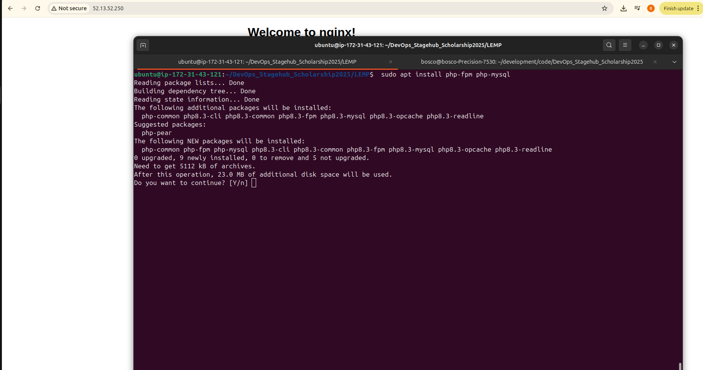
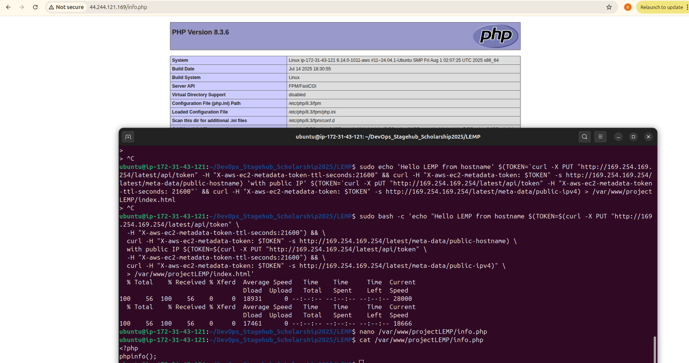
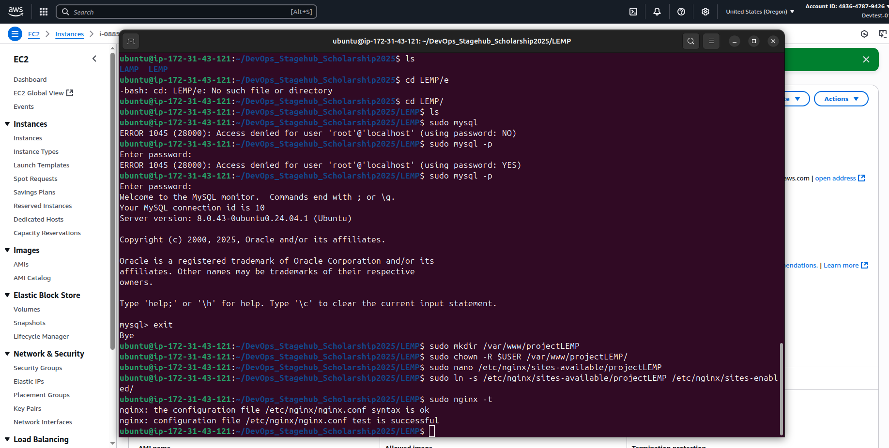
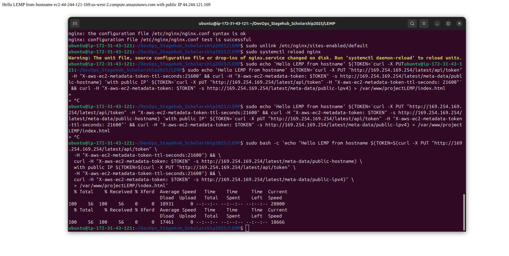

# LEMP Stack
 A simple todo list app configured in AWS ec2 instance using Nginx,Mysql and PHP-LEMP Stack

 ## Tech Stack
 - Linux
 - Nginx
 - Mysql
 - PHP

## Step 1. SSH into the AWS EC2 Instance
Login to AWS console using the IAM user account created.Launch an EC2 instance and once its up and running ssh into the server
```sh
   ssh -i LEMP_Stack.pem ubuntu@public-ip address 
```
## Step 2. 
Create a github repository on your github account
add the github repo to AWS EC2 Instnace
```sh
  git clone git@github.com:boscokosgei/DevOps_Stagehub_Scholarship2025.git
```
## Step 3. Installing Nginx Web Server
To install nginx server we begin by running the following commands
```sh 
   sudo apt install nginx -y
   sudo systemctl status nginx
```
After successful installation, nginx can be accessed on the browser using public ip address as shown below


## Step 4. Installing MYSQL
To install mysql server for database management
use the following commands
```sh
   sudo apt install mysql-server 
```
Then login to mysql and create a user and database


## Step 5. Installing Secure Mysql
To ensure security for the db is maintained a secure mysql is installed
with the setting as shown below
```sh 
   sudo mysql_secure_installation
```


## Step 6. Installing PHP
To install PHP for dynamic content for the web server. USe the command below to install the two packages
```sh
    sudo apt install php-fpm php-mysql
```
## Step 7. Configuring Nginx to use PHP Processor
Create a project directory in the EC2 instance
```sh
    sudo mkdir /var/www/projectLEMP
```

Assigning Ownership to the directory
```sh
    sudo chown -R $USER
```

Testing the configuration by running the command
```sh
   nginx -t
```

Create an index.html file for the website to display IP address of EC2 Instance




Accessing the website using the public IP on browser with port 80
```sh
    http://<public-ip>:80
```


## Step 8. Testing PHP with Nginx
To validate that nginx can handle .php file off to the PHP processor 
a new file info.php is created with nano editor

```sh 
    nano /var/www/projectLEMP/info.php
```
on the file
```sh
   <?php
   phpinfo(); 
```
Accessing the page on the browser using Public IP


## Step 9. Retriving Data from MySql database with PHP
To test this we will create a test database with a simple To do list
and configure to access it.So that Nginx will be able to query data form db and display it.
Connect to the database and create a new database
```sh
   sudo mysql 
   mysql> CREATE DATABASE 'example_database'
``` 

Confirming the database was created


Create a todo-list 
```sh
   nano /var/www/projectLEMP/todo_list.php

```


Accessing the page through a web browser
```sh
    http://public-ip/todo_list.php
```


Finaly the PHP environment is ready to connect and interact with MySQL server