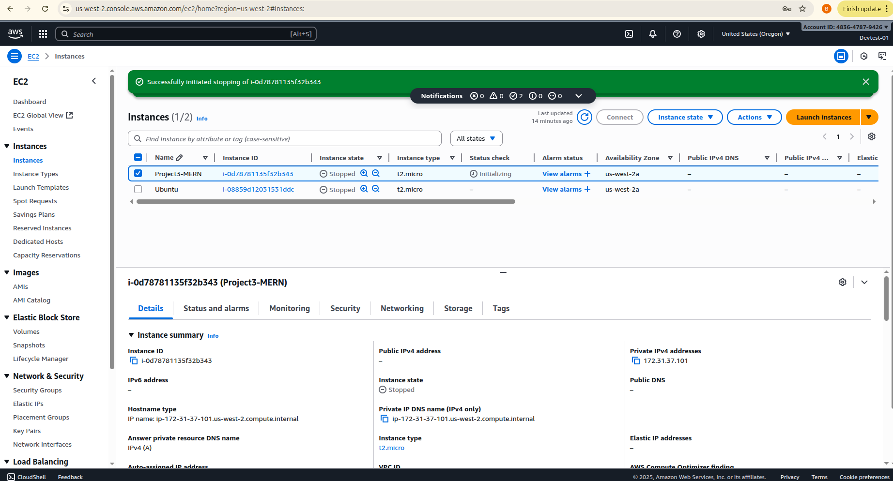
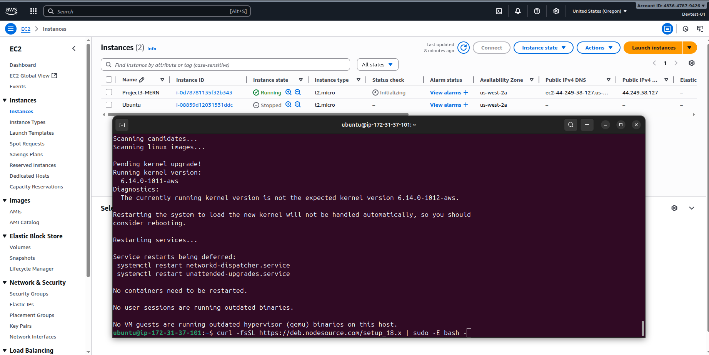
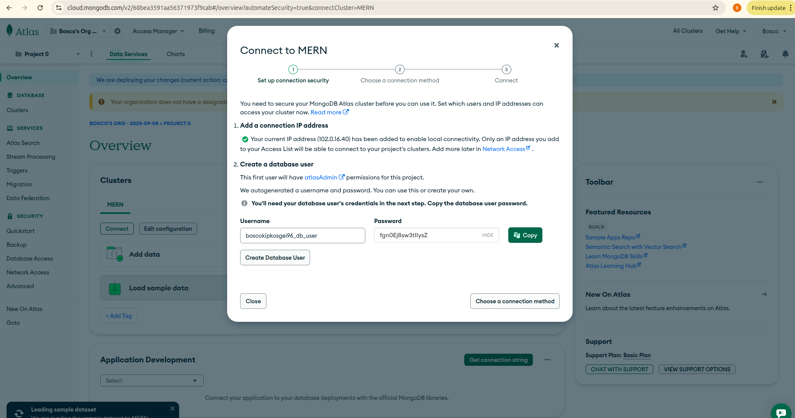
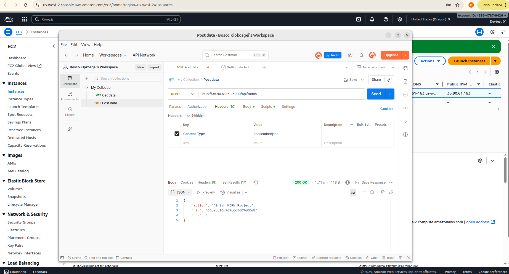
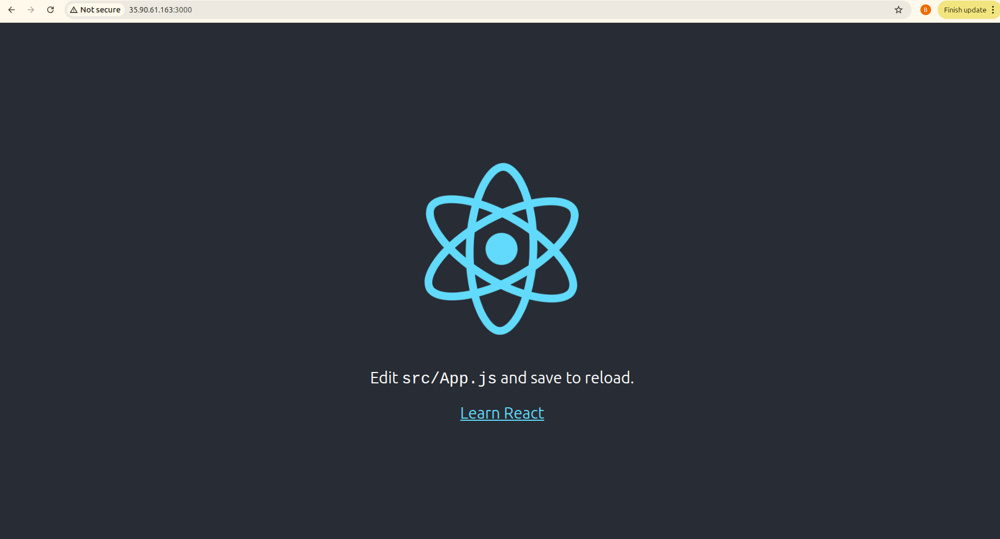

# A Simple Todo Application
Project in Web evelopment to create a simple Todo App using Mern Stack

## Prerequisite
- Linux
- AWS Console
- Git

## Step 1. Accessing the AWS Dashboard to Launch an EC2 Instance
Navigate to aws.console.signup and login with aws account details
Launch an EC2 instance choosing ubuntu ami image


after successful runnning the instance ssh into it
```sh
    ssh -i MERN.pem ubuntu@public ip
```
## Step 2. Backend Configuration
Install Node.js and create an App Directory
```sh
   curl -fsSL https://deb.nodesource.com/setup_18.x | sudo -E bash -
   sudo apt-get install -y nodejs
```


Veryfying node.js had been installed


## Step 3. Installing Express.js
On the Project directory run the following commands to istal express js
```sh
    npm install express 
```


Create an index.js file
```sh 
   touch index.js
```

Install dotenv  module
```sh  
   npm install dotenv
```

After updating the script with the code.Verify the server is running
```sh
    node index.js
``` 


## Step 4. Create Routes
Create a folder called routes on Todo Directory and inside the directory create an api.js file.
```sh
   mkdir routes
   touch api.js
```


## Step 5. Install Mongodb
The app is going to use a NOSQL database callled mongodb.We will create the database schema
```sh
   npm install mongoose
```

Create a new folder called models
```sh
   mkdir models
   touch /models/todo.js
```
Updating the todo.js file to have the information


## Step 6. Create a Cluster Database on MongoDB website
navigate to 
https://www.mongodb.com/products/try-free/platform/atlas-signup-from-mlab

Sign up and create an account


Create a Cluster and allow access from anywhere in network setting.Though not recommmended but for testing thats what we will use.

Create Users to access the database


Create an environment file for application to connect
```sh
   touch .env
   vi .env
```
Update the file to have the string from mongodb

Update the index.js file to have the following information

## Step 7.Testing Backend Code without Frontend using RESTful API
In this project we will use postman to test our application if information can be updated to database and retrieved from database
Download and install postman

Checking on Database it items has been update


## Step 8. Frontend Creation
To install the frontend 
```sh
    npx create-react-app-client
```


Running the react app



## Creating React Components
We create a components folder inside client directory


Updating Security group on AWS to allow port 3000


Running the application
```sh
   npm run dev
```


Accessing the Application on a browser


A simple  todo application has been created with MERN stack